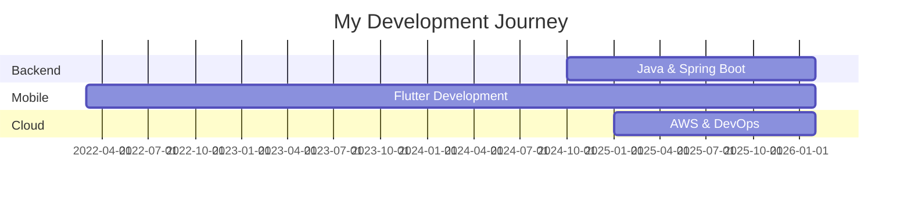

<div align="center">

# 👋 Hi, I'm Minhazul Islam

### Full Stack Developer | Backend Specialist | Mobile App Developer | Data Science Enthusiast


</div>

---

## 🚀 About Me

```typescript
const minhaz = {
    location: "🌎 Dhaka, Bangladesh",
    currentRole: "Backend Developer @ QuantiaLab (Remote)",
    workLocation: "Guadalajara, Jalisco, Mexico",
    focusAreas: ["Backend Development", "Mobile Apps", "AI Integration"],
    currentlyLearning: ["Microservices", "Cloud Architecture", "AI/ML"],
    askMeAbout: ["Java", "Spring Boot", "Flutter", "PostgreSQL", "System Design"],
    funFact: "I turn coffee into code ☕️"
};
```

---

## 🛠️ Tech Arsenal

<details open>
<summary><b>🔧 Backend & Server</b></summary>
<br>


</details>

<details open>
<summary><b>📱 Mobile Development</b></summary>
<br>


</details>

<details open>
<summary><b>🎨 Frontend</b></summary>
<br>


</details>

<details open>
<summary><b>💾 Databases</b></summary>
<br>


</details>

<details open>
<summary><b>☁️ Cloud & DevOps</b></summary>
<br>


</details>

---

## 🌟 Featured Projects

<table>
<tr>
<td width="50%">

### 🤖 Quantia AI Platform
**Naia Residencial & Noa CRM**

An enterprise-grade AI-powered platform featuring voice and text capabilities for customer relationship management.

**Tech Stack:**
- ☕ Java & Spring Boot
- 🐘 PostgreSQL
- ⚛️ ReactJS
- 📱 Flutter
- 🧠 OpenAI API

**Highlights:**
- Real-time voice AI integration
- Scalable microservices architecture
- Cross-platform mobile support

</td>
<td width="50%">

### 📊 Sales Management System

A comprehensive full-stack solution for managing sales operations and client relationships.

**Tech Stack:**
- 🍃 Spring Boot
- 🗄️ PostgreSQL
- ⚛️ ReactJS

**Highlights:**
- RESTful API design
- Real-time analytics dashboard
- Secure authentication system

</td>
</tr>

<tr>
<td width="50%">

### 📝 Quiz Application

A cross-platform quiz application with smooth HTTP API integration and state management.

**Tech Stack:**
- 📱 Flutter
- 🔧 Provider

**Highlights:**
- Clean architecture pattern
- Offline-first approach
- Beautiful UI/UX

</td>
<td width="50%">

### 🎓 LMS Community Platform

Learning management system with community features implementing clean architecture principles.

**Tech Stack:**
- 📱 Flutter
- 🌊 Riverpod

**Highlights:**
- Feature-first architecture
- Advanced state management
- Social learning features

</td>
</tr>
</table>

---

## 📊 GitHub Analytics

<div align="center">
  


</div>

---

## 🏆 GitHub Achievements

<div align="center">

[](https://github.com/ryo-ma/github-profile-trophy)

</div>

---

## 🔝 Top Contributions

<div align="center">


</div>

---

## 💼 Professional Timeline



---

## 🤝 Let's Connect

<div align="center">

[](https://linkedin.com/in/minhazul-islam-7ab09a192)
[](https://facebook.com/minhaz.74692)
[](mailto:minhaz.ipe.sust.com)
[](https://minhaz74692.github.io/md.mie/)
 
</div>

---

## 📈 Contribution Graph

<div align="center">

[](https://github.com/minhaz74692)

</div>

---

## 💡 Random Dev Quote

<div align="center">


</div>

---

<div align="center">

### 📊 Profile Views


### ⭐ Show some love by starring my repositories!

**"Code is like humor. When you have to explain it, it's bad." – Cory House**

</div>

---

<div align="center">

**💙 Thanks for visiting my profile!**

</div>
